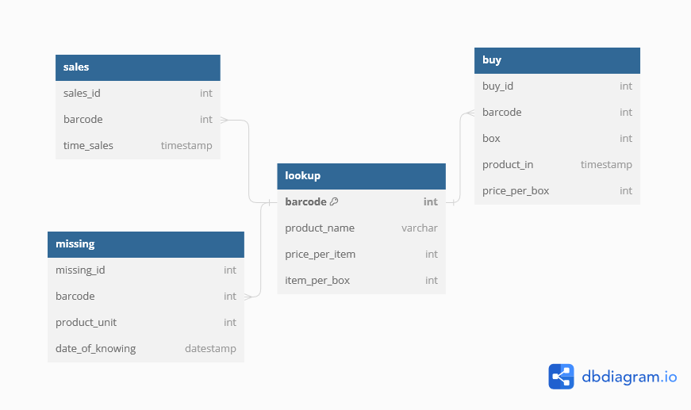

# SQL AND PYTHON FOR SMALL SHOP

## BACKGROUND

This project is inspired from the foundation where I study English. There is a small shop and a lot of students buy food and drinks in a break time. I found the problem that they felt difficult to find the profit from the business.

There are so many transactions that they cannot record or write on a book. It has an impact on calculating profit. They do not know what product is missing, how many item sold from that product and so on.

So I think it would be good if there is a tool to record all transactions. I think, not only super market that needs barcode scanner machine, but small shop as well. Because of the machine will input the barcode, so I guess it will work if I use SQL to record all transaction and Python to do the stuff under the hood.

## WORKFLOW

I create table _lookup_ to store the detail of every product. Then I create other tables like _sales_ to record all transactions, _missing_ to record missing products, and _buy_ to record all product in. I also create pseudo table using _view_ to see _sales_ with name.

0. Install your favourite RDBMS and Python interpreter.
1. I have to run _warung fix.sql_ as a script to create all tables.
2. I have to run _views.sql_ as a script to create pseudo table.
3. Insert a product or more into table lookup using _lookup.py_ to facilitate input product to database.
4. Record sales, buy, and missing product will fail if product does not exist in lookup table.
5. Open _buy.py_ when you buy product for stock.
6. Open _sales.py_ when the shop open. It will record the transaction all the day until you type _Exit_.
7. When someone buys a product two pieces, you have to scan it twice.
8. A _missing.py_ is used better on the last day of the month when you are about to do Inventory take.

## IMPROVEMENT

I still improve this project. In the future, I want to add trigger to automatically calculate profit/loss and expense/cost.